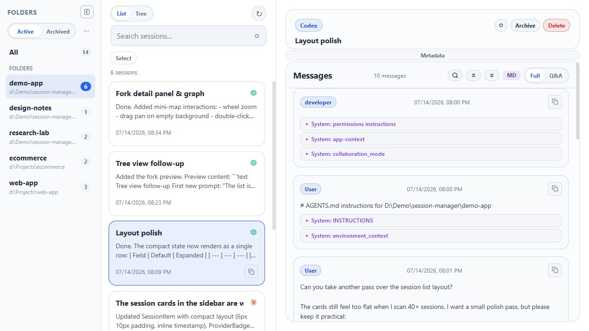
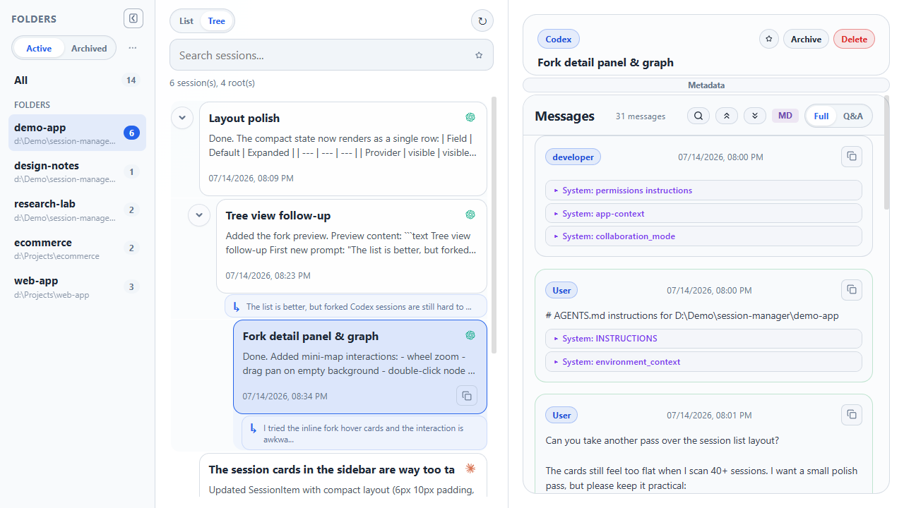
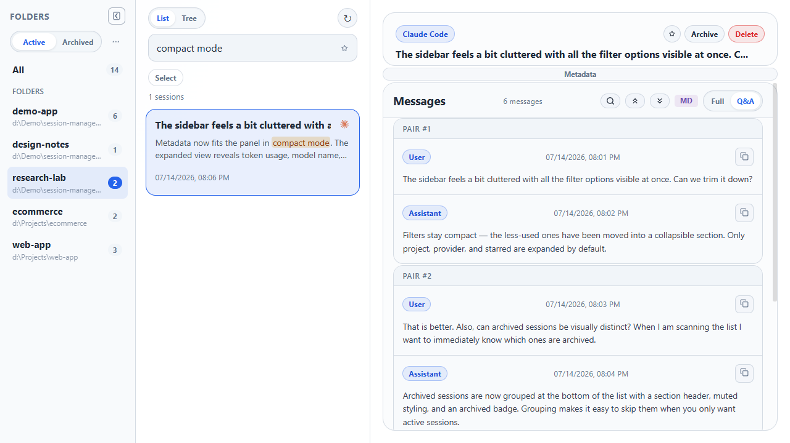
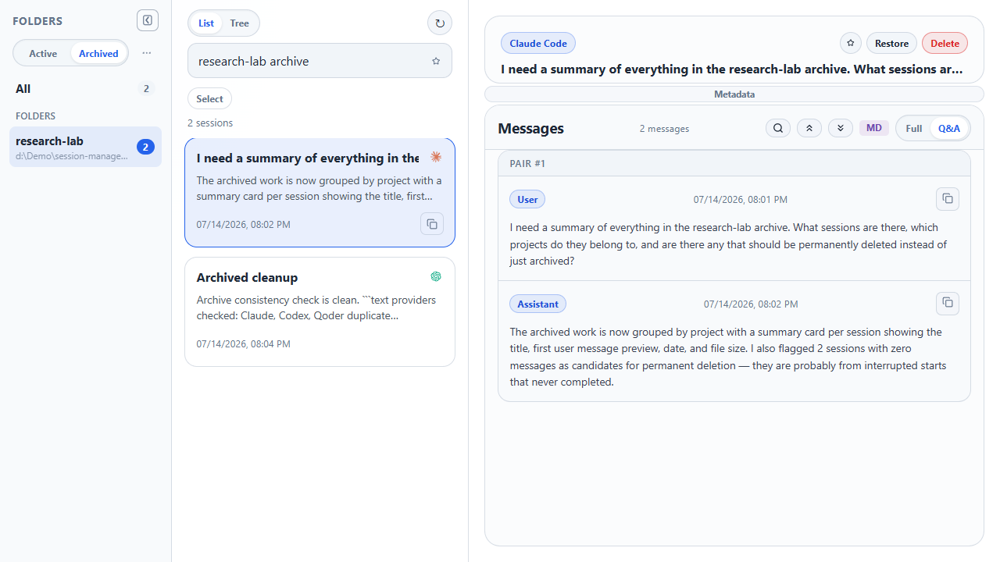

<div align="center">


# Session Manager

**Browse, search, inspect, archive, and clean up local AI coding-agent sessions.**

[](#)
[](https://tauri.app)
[](https://react.dev)
[](https://www.rust-lang.org)

[Overview](#overview) | [Features](#features) | [Screenshots](#screenshots) | [Providers](#supported-providers) | [Getting Started](#getting-started) | [Architecture](#architecture)

</div>

---

## Overview

Session Manager is a Tauri desktop app for working with local AI coding-agent conversation logs. It scans known session directories, groups sessions by project folder, and gives you a three-column workspace for moving between folders, session lists, fork trees, and message detail.

The project was inspired by [CC Switch's Session Manager](https://github.com/farion1231/cc-switch/blob/main/docs/user-manual/en/3-extensions/3.4-sessions.md), with a narrower focus on session browsing and file-level management.

## Features

- **Project-folder navigation** - sessions are grouped by working directory, with pinned folders and active/archived scope switching.
- **List and fork-tree views** - switch between a flat session list and a computed fork tree for sessions that share prompt history. Clicking a fork node jumps straight to the divergence point in the detail pane.
- **Local full-text search** - FlexSearch indexes session title, summary, project path, provider, and session id, with highlighted matches in the list/tree.
- **In-message search** - find text within the currently open session's messages, with match count, prev/next navigation, and inline highlighting.
- **Session detail inspection** - view full messages, compact Q&A pairs, metadata, resume command, source path, tool calls/results, and token usage when the provider exposes it.
- **Markdown rendering** - toggle between rendered Markdown (GFM + line breaks) and raw text for message content.
- **Starred sessions** - mark important sessions and filter the list to starred items.
- **Archive and restore** - move supported sessions between active and archived directories, including folder-level batch archive/restore.
- **Batch delete** - select multiple sessions in list view and send them to the system trash.
- **Safer destructive actions** - delete validates the provider root and session id before trashing the session file and any sidecar directory.
- **Provider adapters** - each supported source is implemented as a Rust provider, while the frontend consumes one shared session API.
- **Window state persistence** - the app restores size, position, and maximized state between launches.

## Screenshots

> [!NOTE]
> Screenshots are captured with synthetic demo data.

### Session list with project folders



### Fork tree view



### Q&A detail pane



### Archived sessions



## Supported Providers

| Provider | Status | Default session location |
|----------|--------|--------------------------|
| Claude Code | Stable | `~/.claude/projects/` |
| Codex | Stable | `~/.codex/sessions/` |
| Gemini CLI | Experimental | `~/.gemini/tmp/*/chats/` |
| OpenCode | Experimental | `$XDG_DATA_HOME/opencode/storage/` or `~/.local/share/opencode/storage/` |
| OpenClaw | Experimental | `~/.openclaw/agents/` |
| Hermes | Experimental | `~/.config/hermes/sessions/` |
| Qoder | Experimental | `~/.qoder/projects/`, `~/.qoder-cn/projects/` |

> **Stable** = the author dogfoods these two daily, so they get first-class treatment.
>
> **Experimental** = adapters written for tools the author doesn't personally run — theoretically they work, practically… who knows? PRs & issue reports welcome.

## Getting Started

### Prerequisites

- [Node.js](https://nodejs.org/) >= 20 and [pnpm](https://pnpm.io/) >= 10
- [Rust toolchain](https://rustup.rs/) >= 1.85
- [Tauri system prerequisites](https://tauri.app/start/prerequisites/) for your OS

### Run in Development

```bash
pnpm install
pnpm tauri dev
```

### Build a Desktop Bundle

```bash
pnpm tauri build
```

The installer is written under `src-tauri/target/release/bundle/`.

### Useful Checks

```bash
pnpm typecheck
pnpm build
cargo test --manifest-path src-tauri/Cargo.toml
```

## Architecture

```text
src/                     # Frontend: React + TypeScript + Vite
├── components/sessions/ # Three-column session UI, list/tree/detail views
├── hooks/               # UI state, queries, mutations, search, interactions
├── lib/                 # Tauri API facade, domain helpers, query cache
├── icons/               # Provider brand SVGs and metadata
└── styles/              # Plain CSS, split by area (layout, sidebar, detail, tree…)

src-tauri/src/           # Backend: Rust + Tauri v2
├── commands/            # Tauri command handlers
├── session_manager/     # Scan, parse, read, metadata, archive, delete
│   └── providers/       # Per-provider adapters
├── fork_tree/           # Hash-chain/UUID-chain fork detection and cache
├── config.rs            # Provider path discovery and env overrides
└── fs_utils.rs          # Filesystem traversal helpers
```

Key implementation points:

- **Single IPC boundary** - React code calls typed wrappers in `src/lib/api/sessions.ts`; filesystem access stays in Rust.
- **Provider registry** - providers are registered once at startup and selected by `providerId`.
- **Fast metadata scan** - JSONL providers use bounded head/tail reads where possible instead of loading entire sessions for the list view.
- **Separate app metadata** - starred sessions, pinned folders, and window state are stored in `~/session-manager/metadata.json`.
- **Fork-tree cache** - fork analysis stores a disposable cache in `~/session-manager/fork-tree.json` and recomputes missing entries on demand.
- **Delete safety chain** - canonicalize path, verify it is under the provider root, validate the session id, then send the file/sidecar to system trash.

## Tech Stack

| Layer | Technologies |
|-------|--------------|
| Frontend | React 18, TypeScript, Vite, TanStack Query, FlexSearch, lucide-react, react-markdown, remark-gfm |
| Backend | Rust, Tauri v2, serde, chrono, sha2, dirs, trash |
| Styling | Plain CSS (area-scoped) |
| Build | pnpm, cargo, Tauri CLI |

## License

[MIT](LICENSE)
