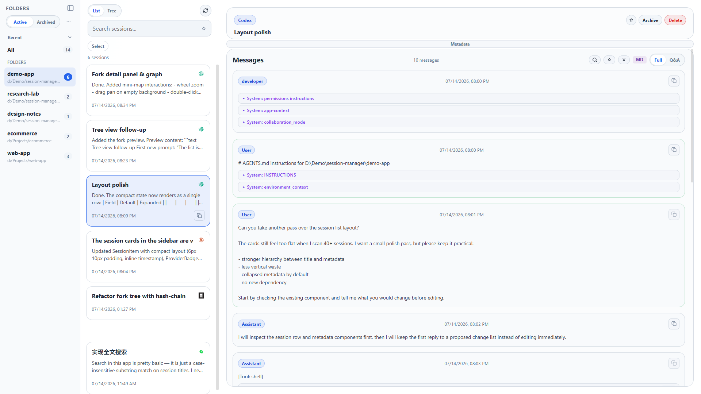
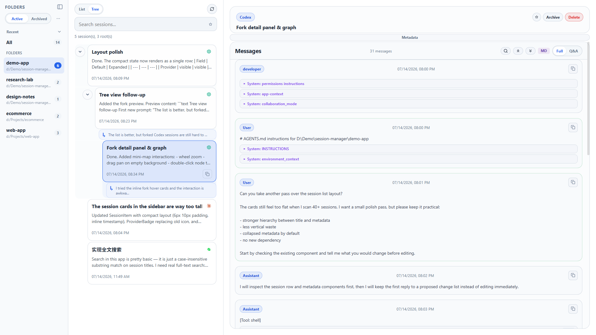
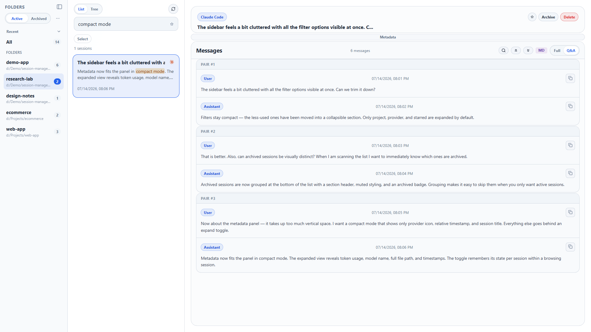
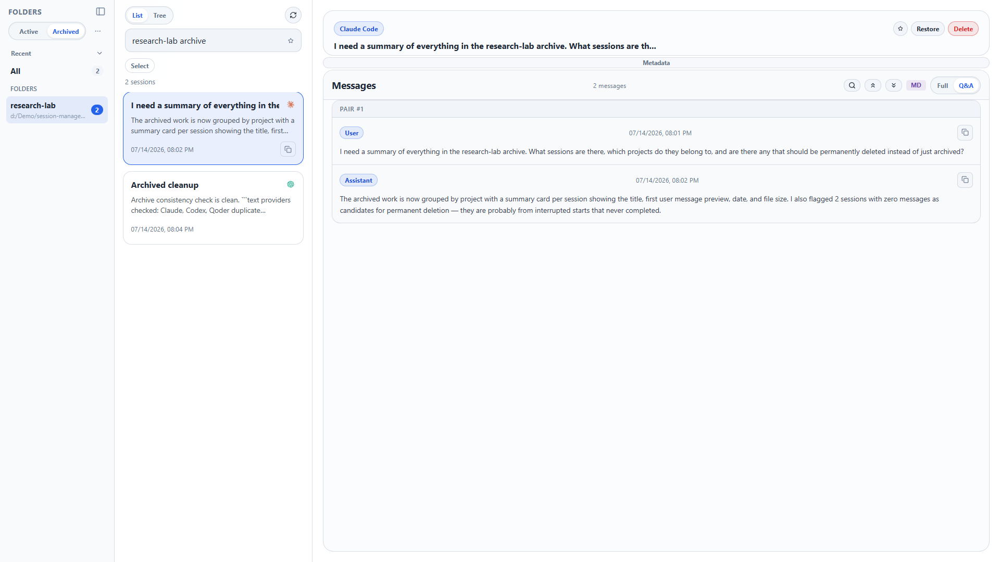

<div align="center">


# Session Manager

**Browse, search, inspect, archive, and clean up local and remote (SSH) AI coding-agent sessions.**

[](https://github.com/CatheadOwl/session-manager/releases/latest)
[](https://tauri.app)
[](https://react.dev)
[](https://www.rust-lang.org)

[Overview](#overview) | [Install](#install) | [Features](#features) | [Screenshots](#screenshots) | [Providers](#supported-providers) | [Remote Sources](#remote-sources-ssh) | [Development](#development) | [Manual Settings](#manual-settings) | [Architecture](#architecture)

</div>

---

## Overview

Session Manager is a Tauri desktop app for working with AI coding-agent conversation logs. It scans known session directories — local ones by default, and remote (SSH) hosts registered as additional read-only sources — and gives you a three-column workspace for moving between folders, session lists, fork trees (branching views of sessions that share prompt history), and message detail.

The project was inspired by [CC Switch's Session Manager](https://github.com/farion1231/cc-switch/blob/main/docs/user-manual/en/3-extensions/3.4-sessions.md), with a narrower focus on session browsing and file-level management.

## Install

Download the latest installer from [GitHub Releases](https://github.com/CatheadOwl/session-manager/releases/latest):

| Platform | Artifacts |
|----------|-----------|
| Windows | `*-x64-setup.exe` (NSIS) or `*-x64_en-US.msi` |
| macOS | `*universal.dmg` — Apple Silicon and Intel |
| Linux | `.deb`, `.rpm`, or `.AppImage` |

- Updates are delivered by the built-in auto-updater (checks on startup; can be turned off in Settings).
- The Windows installer is not code-signed, so SmartScreen will show an "unknown publisher" warning — choose "More info → Run anyway" to proceed.
- [CHANGELOG.md](CHANGELOG.md) lists what changed in each release.

## Features

- **Project-folder navigation** - sessions grouped by working directory, with pinned folders and active/archived scopes.
- **List and fork-tree views** - flat list or a fork tree of sessions that share prompt history.
- **Session search** - filter the session list by title, summary, project path, or session id.
- **In-session search** - find text within the currently open session's messages, with match count and prev/next navigation.
- **Session detail** - full messages or compact Q&A pairs, with metadata, tool calls, and a Markdown rendering toggle.
- **Starred sessions** - mark important sessions and filter to them.
- **Archive and restore** - single or folder-level batch, between active and archived directories.
- **Batch delete** - checkbox selection (tri-state select-all) scoped to the visible list; the provider root and session id are validated before anything is trashed.
- **Time-ranged Q&A export** - export the visible sessions as Q&A-distilled JSON or Markdown with full provenance; also scriptable headlessly (`session-manager export --help`).
- **SSH remote sources** - register remote hosts as read-only sources and browse their sessions alongside local ones ([details](#remote-sources-ssh)).

## Screenshots

> [!NOTE]
> Screenshots are captured with synthetic demo data.

### Session list with project folders



### Fork tree view



### Q&A detail pane



### Archived sessions



## Supported Providers

| Provider | Status | Default session location |
|----------|--------|--------------------------|
| Claude Code | Stable | `~/.claude/projects/` |
| Codex | Stable | `~/.codex/sessions/` |
| Gemini CLI | Experimental | `~/.gemini/tmp/*/chats/` |
| OpenCode | Experimental | `$XDG_DATA_HOME/opencode/storage/` or `~/.local/share/opencode/storage/` |
| OpenClaw | Experimental | `~/.openclaw/agents/` |
| Hermes | Experimental | `~/.config/hermes/sessions/` |
| Qoder | Experimental | `~/.qoder/projects/`, `~/.qoder-cn/projects/` |
| Pi | Experimental | `~/.pi/agent/sessions/` |

> **Stable** = the author dogfoods these two daily, so they get first-class treatment.
>
> **Experimental** = adapters written for tools the author doesn't personally run — theoretically they work, practically… who knows? PRs & issue reports welcome.

## Remote Sources (SSH)

Remote sources let you browse sessions that live on another machine — for example a Linux dev server where Codex or Claude Code runs over VS Code Remote SSH.

Open **Settings** (the gear at the bottom of the folder strip) → **Sources** → **Add SSH source**. Two entry paths, both with a connection test before saving:

- **Alias picker** - lists `Host` aliases from your `~/.ssh/config`; connection settings and keys are read live from the config block (ssh-agent identities first, then the block's `IdentityFile`). `ProxyJump` hosts are not supported yet and are greyed out.
- **Manual form** ("Advanced") - enter host / port / user yourself and pick an auth mode: ssh-agent, or an explicit key file (`~` expanded).

Behavior:

- Provider session directories are discovered automatically under the remote home (`~/.codex/sessions/`, `~/.claude/projects/`, …) — same providers as local, no remote path configuration.
- Remote sessions appear in the same list and detail views; message content is fetched over SSH when you open a session and cached locally for re-opens and exports.
- Remote sources are **read-only** in this release: delete / archive / restore remain local-only.
- The remote cache lives in the OS cache directory (`%LOCALAPPDATA%\session-manager\remote-cache` on Windows) and is safe to delete at any time — deleted entries are simply refetched on the next open.

## Development

### Prerequisites

- [Node.js](https://nodejs.org/) >= 20 and [pnpm](https://pnpm.io/) >= 10
- [Rust toolchain](https://rustup.rs/) >= 1.85
- [Tauri system prerequisites](https://tauri.app/start/prerequisites/) for your OS

### Run in Development

```bash
pnpm install
pnpm tauri dev
```

### Build a Desktop Bundle

```bash
pnpm tauri build
```

The installer is written under `src-tauri/target/release/bundle/`.

### Useful Checks

```bash
pnpm typecheck
pnpm build
cargo test --manifest-path src-tauri/Cargo.toml
```

## Manual Settings

Settings are editable from the app's Settings panel, and also live in a hand-editable file (VS Code-style) — both edit the same data:

```
~/.session-manager/settings.json
```

The file is JSONC (comments allowed) and stores only overridden keys: values equal to the built-in defaults are omitted, and `version` is always written. Restart the app after hand-editing.

| Key | Type | Default | Semantics |
|-----|------|---------|-----------|
| `version` | number | *(always written)* | Migration anchor; current = `1` |
| `update.autoCheck` | bool | `true` | `false` skips the automatic update check on startup (manual retry still works) |
| `sources[]` | array | `[]` | Extra session sources, scanned in addition to the built-in provider locations. Entries carry a `kind` tag: local entries have no `kind` key, SSH entries carry `"kind": "ssh"` |

**Local source** — `path` points at an **alternate home root**: every provider's standard directory is discovered under it, same model as a remote machine. There is no per-entry `provider` field anymore; a legacy `provider` key from an older file is preserved but ignored.

**SSH source** — `host`/`port`/`user` plus an `auth` block with three modes — `sshConfig` (alias from `~/.ssh/config`), `agent` (ssh-agent), or `key` (explicit key file):

```jsonc
{
  "version": 1,
  "update": { "autoCheck": false },
  "sources": [
    // local: alternate home root, providers discovered under it
    { "path": "D:\\home-mirror", "enabled": true },
    // ssh: alias mode — settings read live from ~/.ssh/config
    { "kind": "ssh", "id": "devbox", "host": "", "user": "", "port": 22,
      "auth": { "mode": "sshConfig", "alias": "dev" } },
    // ssh: agent / explicit key modes
    { "kind": "ssh", "id": "build", "host": "192.0.2.10", "user": "admin", "port": 2222,
      "auth": { "mode": "key", "keyPath": "~/.ssh/id_ed25519" } }
  ]
}
```

Common entry fields: `enabled` (default `true`; disabled entries are kept but not scanned), `id` (required for SSH, optional for local), `label` (optional, SSH).

Loading is lenient — a broken file never blocks startup (defaults are used), unknown keys are preserved on programmatic saves, and wrong-typed known keys fall back to defaults with a logged warning.

> [!NOTE]
> Comments are a hand-editing convenience only: the first time the app saves the file programmatically (e.g. changing a setting from the UI), comments are dropped.

## Architecture

```text
src/                     # Frontend: React + TypeScript + Vite
├── components/sessions/ # Three-column session UI, list/tree/detail views
├── hooks/               # UI state, queries, mutations, search, interactions
├── lib/                 # Tauri API facade, domain helpers, query cache
├── icons/               # Provider brand SVGs and metadata
└── styles/              # Plain CSS, split by area (layout, sidebar, detail, tree…)

src-tauri/src/           # Backend: Rust + Tauri v2
├── commands/            # Tauri command handlers
├── session_manager/     # Scan, parse, read, metadata, archive, delete
│   ├── providers/       # Per-provider adapters
│   └── remote/          # SSH remote sources: russh connection, alias resolution, batch scan, transient cache
├── fork_tree/           # Hash-chain/UUID-chain fork detection and cache
├── cli.rs               # Dual-mode dispatch: CLI subcommands (export) run before the GUI launches
├── settings.rs          # Hand-editable settings core + IPC (sources, update checks)
├── config.rs            # Provider path discovery and env overrides
└── fs_utils.rs          # Filesystem traversal helpers
```

Key implementation points:

- **Hash-chain fork detection** - sessions are related by comparing user-input hash chains (SHA-256, first 8 hex); longest-common-prefix matching reconstructs lineage even when the provider records no explicit parent id.
- **Bounded metadata scan** - list view reads only the head/tail of each JSONL file instead of parsing full conversations.
- **Disposable fork-tree cache** - fork analysis persists a version-gated cache keyed by source path; missing entries are computed on demand, stale entries pruned, and losing the file triggers a clean recomputation.

## Tech Stack

| Layer | Technologies |
|-------|--------------|
| Frontend | React 18, TypeScript, Vite, TanStack Query, FlexSearch, lucide-react, react-markdown, remark-gfm |
| Backend | Rust, Tauri v2, serde, chrono, sha2, dirs, trash, russh, russh-sftp |
| Styling | Plain CSS (area-scoped) |
| Build | pnpm, cargo, Tauri CLI |

## Contributing

See [CONTRIBUTING.md](CONTRIBUTING.md) for commit and workflow conventions; bug reports and feature requests go to the [issue tracker](https://github.com/CatheadOwl/session-manager/issues).

## License

[MIT](LICENSE)
